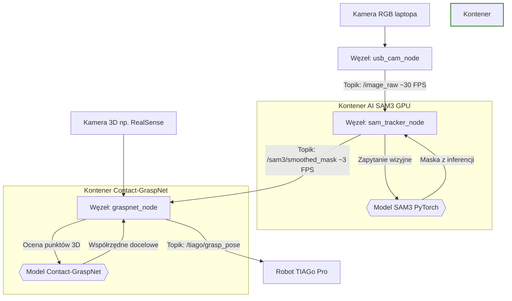

# TiagoProDentist - Tool Perception System

Projekt wykrywania i pozycjonowania narzędzi stomatologicznych w przestrzeni 3D przy użyciu zaawansowanych systemów wizyjnych oraz systemu **ROS 2**. System posiada dwa niezależne potoki (pipelines) detekcji dla robota TIAGo Pro:
1. **Szybka detekcja (YOLOv8)** - przetwarzająca dane z kamery RGB-D, publikująca obraz z detekcjami oraz chmurę punktów.
2. **Precyzyjna segmentacja Zero-Shot (SAM3)** - działająca na dedykowanym węźle z własną heurystyką śledzenia (Temporal Smoothing).

### Architektura Systemu Wieloagentowego

## 🛠️ Wymagania systemowe
- System: Ubuntu 24.04 (Noble Numbat).

- Docker & Docker Compose zainstalowane na hoście.

- Sterowniki NVIDIA (wymagane dla akceleracji GPU wewnątrz kontenera).

- ROS 2 Jazzy / Humble zainstalowany lokalnie (do uruchomienia RViz2 na hoście).

📁 Struktura projektu
```scripts/yolo_to_rviz.py```: Główny węzeł ROS 2 integrujący YOLO z danymi Depth.

```weights/best.pt```: Wytrenowane wagi modelu YOLO.

```bag/```: Folder z nagraniami (RGB i Depth).

```fastdds_no_shm.xml```: Konfiguracja DDS eliminująca błędy przesuwu dużych danych (No Shared Memory).

```sam3/```: Dedykowany moduł i węzeł ROS 2 dla precyzyjnej segmentacji instancji (SAM3). Szczegółowa instrukcja uruchomienia tego potoku znajduje się w sam3/README.md.

## 🚀 Szybki start (Potok YOLOv8)
# 1. Budowanie i uruchomienie kontenera
Będąc w głównym folderze projektu, wykonaj:
```Bash
docker compose build
docker compose up -d
```

# 2. Uruchomienie węzła percepcji
Wejdź do kontenera i odpal skrypt:
```Bash
docker exec -it TiagoProDentist bash
source /opt/ros/jazzy/setup.bash
python3 scripts/yolo_to_rviz.py
```

# 3. Wizualizacja w RViz2 (Na Hoście)
Aby zobaczyć wyniki, otwórz nowy terminal na Ubuntu i:

Uruchom publikator statycznego układu współrzędnych:
```Bash
ros2 run tf2_ros static_transform_publisher 0 0 0 0 0 0 map camera_color_optical_frame
```

Uruchom RViz2:
```rviz2```

W RViz skonfiguruj:

- Fixed Frame: map

- Image Topic: /detected_tool_image (Reliability: Reliable)

- PointCloud2 Topic: /detected_tool_pc (Reliability: Reliable)

## ⚠️ Rozwiązywanie problemów
- Brak obrazu w RViz: Upewnij się, że na hoście i w Dockerze ustawiono zmienną środowiskową dla FastDDS: ```export FASTRTPS_DEFAULT_PROFILES_FILE=/Shared/fastdds_no_shm.xml.```

- Błąd rclpy: Pamiętaj o wykonaniu ```source /opt/ros/jazzy/setup.bash``` wewnątrz kontenera przed uruchomieniem skryptu.
